# Finance Manager

<div align="center">
  

  <h3 style="margin-top:0;">Money, made clear</h3>
  <p>
    A mobile-first personal finance app for tracking income, expenses, net worth,
    transaction history, and spending patterns from one focused interface
  </p>

  <p>

    
    
    
    
  </p>
</div>

---

## Overview

Finance Manager is a personal finance product built as a polished mobile web app.
It is designed around quick daily use: add transactions fast, review recent moves,
understand where money is going, and explore statistics without feeling like a spreadsheet.

The project started as a personal tool, but it is being developed with the standards of a real product:
secure authentication, owner-scoped financial data, production monitoring, automated tests, a documented API,
and a UI system designed for a consistent mobile experience.

## Product Preview

Finance Manager is designed as a mobile-first product, with a desktop landing page
that explains the app and guides users toward the PWA flow.

<div align="center">
  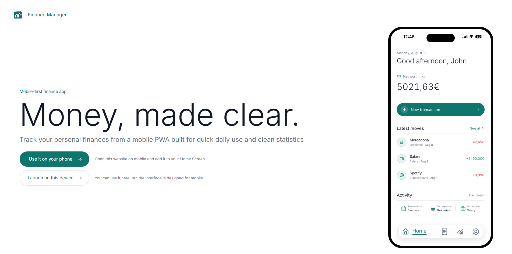
</div>

### Mobile App

<div align="center">
<table align="center" width="100%">
  <tr>
    <td align="center" width="50%">
      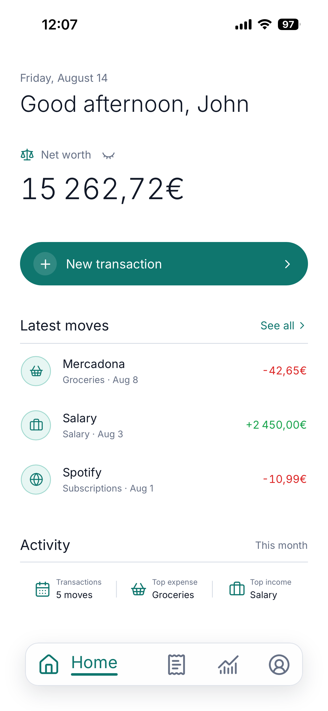
      <br />
      <strong>Home</strong>
      <br />
      A daily snapshot of net worth, latest moves, and monthly activity
    </td>
    <td align="center" width="50%">
      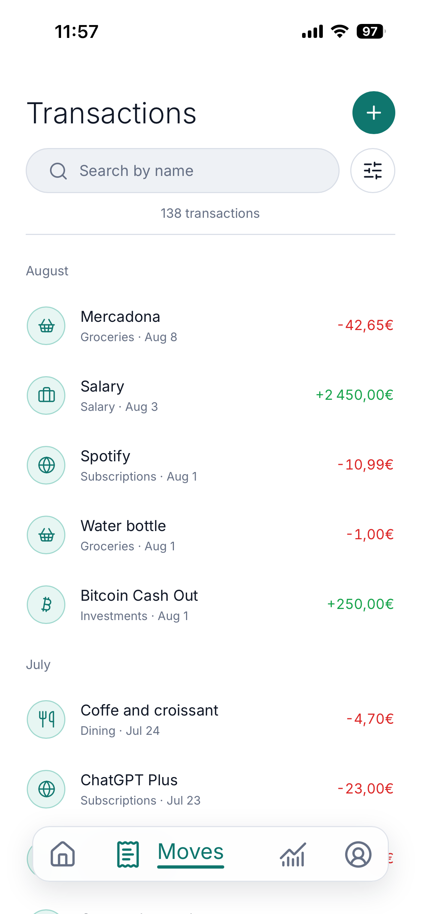
      <br />
      <strong>Transactions</strong>
      <br />
      Searchable history grouped by period, category, amount, and type
    </td>
  </tr>
  <tr>
    <td align="center" width="50%">
      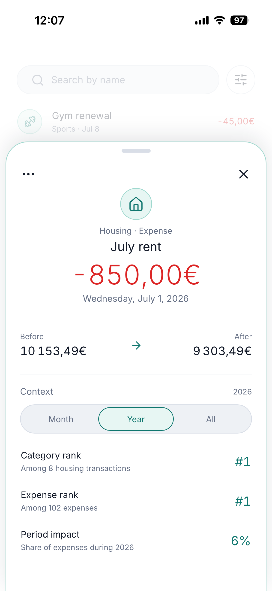
      <br />
      <strong>Transaction Detail</strong>
      <br />
      Ticket-style context for balance impact, ranking, and period share
    </td>
    <td align="center" width="50%">
      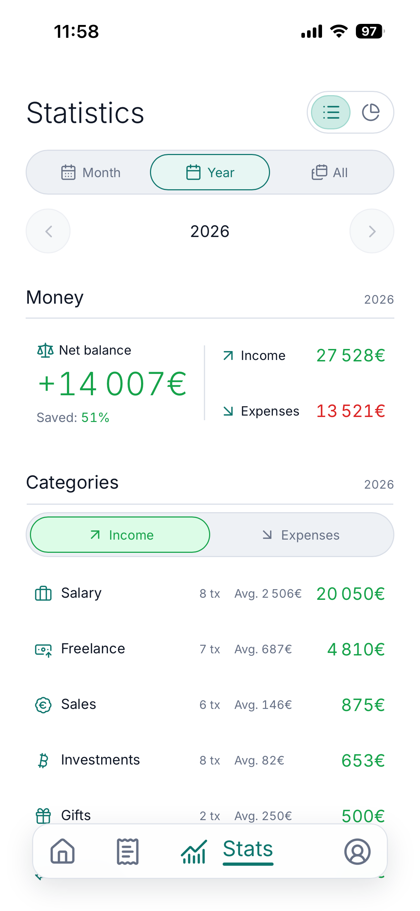
      <br />
      <strong>Statistics</strong>
      <br />
      Real period summaries for balance, income, expenses, and categories
    </td>
  </tr>
  <tr>
    <td align="center" width="50%">
      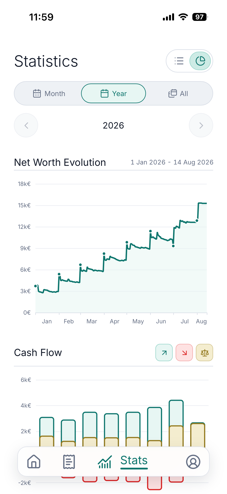
      <br />
      <strong>Charts</strong>
      <br />
      Net worth evolution, cash flow, and visual financial patterns
    </td>
    <td align="center" width="50%">
      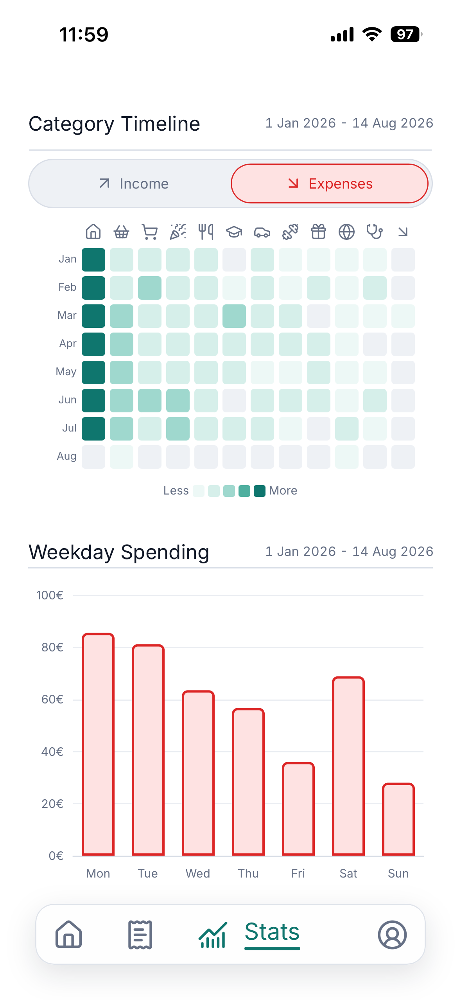
      <br />
      <strong>Patterns</strong>
      <br />
      Category timelines and weekday spending for behavioral insight
    </td>
  </tr>
</table>
</div>

### Focused Interfaces

<div align="center">
<table align="center" width="100%">
  <tr>
    <td align="center" width="50%">
      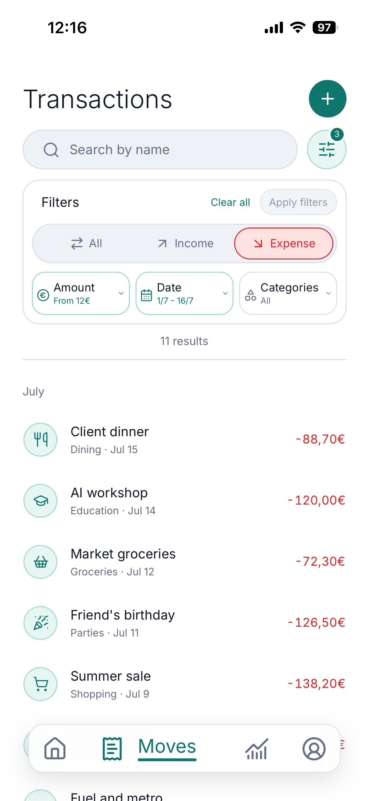
      <br />
      <strong>Smart filters</strong>
    </td>
    <td align="center" width="50%">
      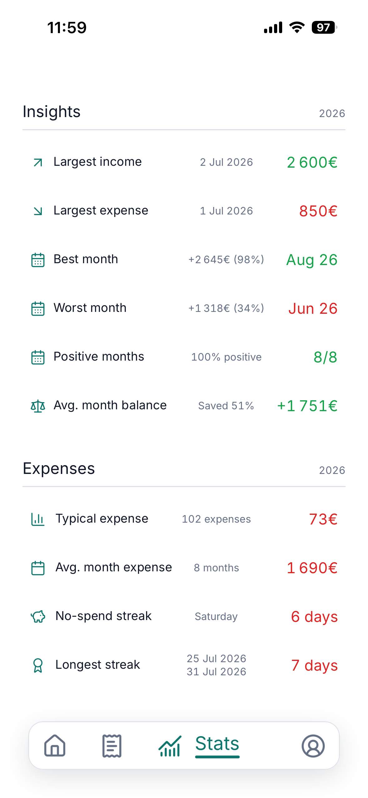
      <br />
      <strong>Period insights</strong>
    </td>
  </tr>
  <tr>
    <td align="center" width="50%">
      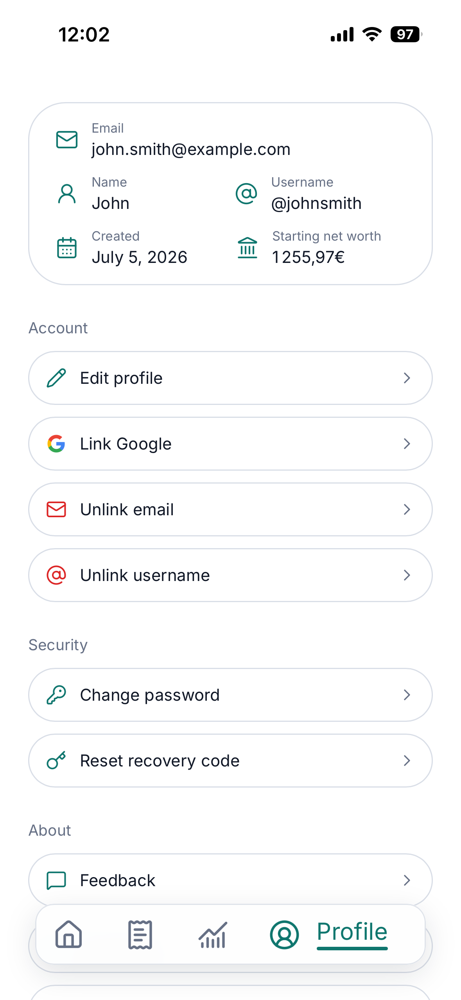
      <br />
      <strong>Flexible account setup</strong>
    </td>
    <td align="center" width="50%">
      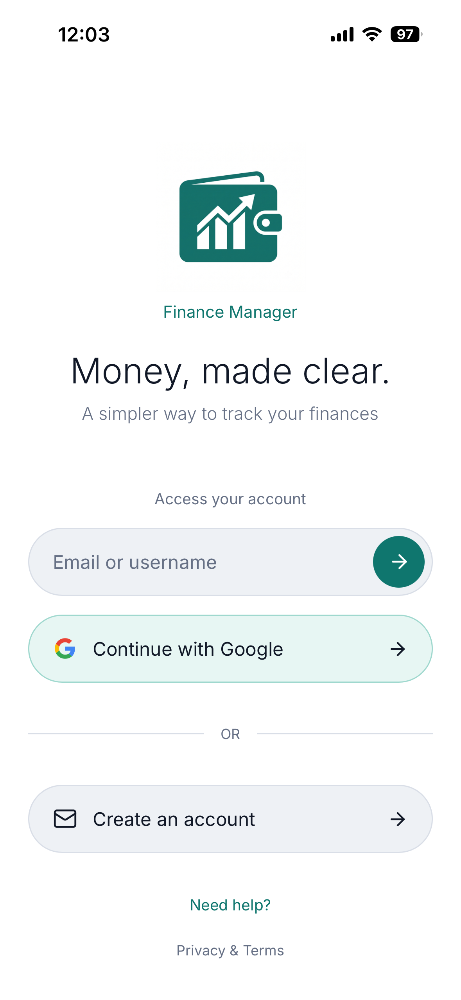
      <br />
      <strong>Sign in</strong>
    </td>
  </tr>
</table>
</div>

<div align="center">
  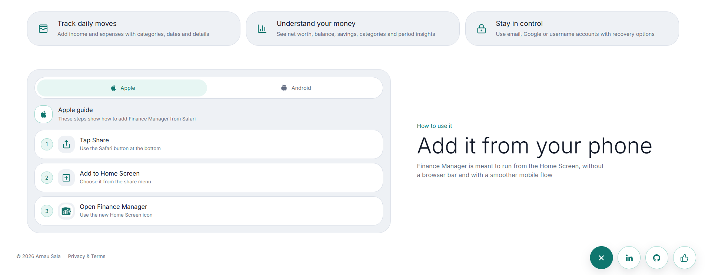
</div>

### Product Scope

<div align="center">
<table align="center" width="100%">
  <tr>
    <td align="center" valign="top" width="50%">
      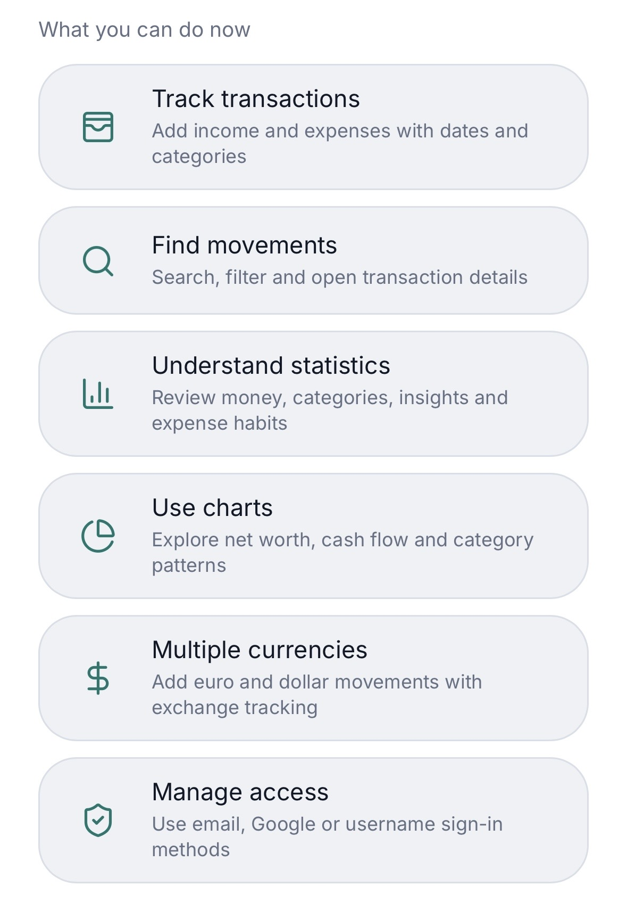
    </td>
    <td align="center" valign="top" width="50%">
      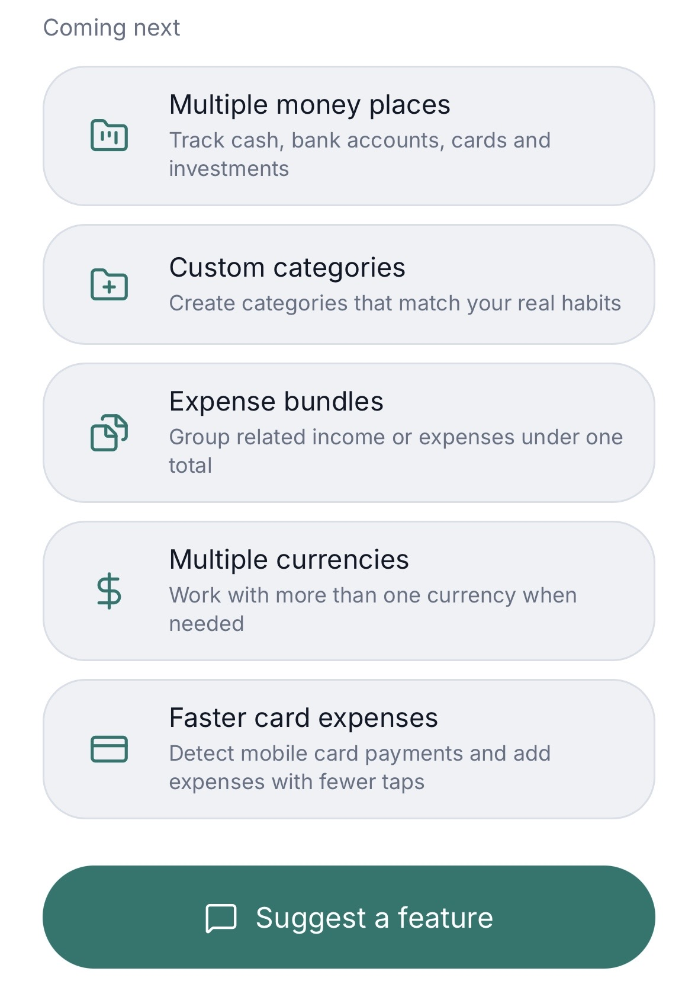
    </td>
  </tr>
  <tr>
    <td align="center" valign="bottom" width="50%">
      <strong>What works today</strong>
    </td>
    <td align="center" valign="bottom" width="50%">
      <strong>Where the product is going</strong>
    </td>
  </tr>
</table>
</div>

## What Makes It Interesting

- It is not just a CRUD app: the main value is in the financial interpretation layer
- The stats screen uses real backend aggregations instead of frontend mock data
- Transaction details include contextual information such as before/after balance and category ranking
- The app supports multiple account types without forcing every user into the same sign-in method
- It combines product UI, backend architecture, authentication, testing, monitoring, and documentation

## Tech Stack

### Web App

<div align="center">
<table align="center" width="100%">
  <tr>
    <td align="center" width="120">
      
      <br />
      <sub>React</sub>
    </td>
    <td align="center" width="120">
      
      <br />
      <sub>TypeScript</sub>
    </td>
    <td align="center" width="120">
      
      <br />
      <sub>Vite</sub>
    </td>
    <td align="center" width="120">
      
      <br />
      <sub>TanStack Query</sub>
    </td>
    <td align="center" width="120">
      
      <br />
      <sub>ECharts</sub>
    </td>
    <td align="center" width="120">
      
      <br />
      <sub>Framer Motion</sub>
    </td>
  </tr>
</table>
</div>

### Backend & Data

<div align="center">
<table align="center" width="100%">
  <tr>
    <td align="center" width="120">
      
      <br />
      <sub>Node.js</sub>
    </td>
    <td align="center" width="120">
      
      <br />
      <sub>Fastify</sub>
    </td>
    <td align="center" width="120">
      
      <br />
      <sub>Zod</sub>
    </td>
    <td align="center" width="120">
      
      <br />
      <sub>Prisma</sub>
    </td>
    <td align="center" width="120">
      
      <br />
      <sub>PostgreSQL</sub>
    </td>
  </tr>
</table>
</div>

### Auth, Email & Quality

<div align="center">
<table align="center" width="100%">
  <tr>
    <td align="center" width="120">
      
      <br />
      <sub>Google OAuth</sub>
    </td>
    <td align="center" width="120">
      
      <br />
      <sub>Brevo</sub>
    </td>
    <td align="center" width="120">
      
      <br />
      <sub>Vitest</sub>
    </td>
    <td align="center" width="120">
      
      <br />
      <sub>Playwright</sub>
    </td>
    <td align="center" width="120">
      
      <br />
      <sub>Storybook</sub>
    </td>
    <td align="center" width="120">
      
      <br />
      <sub>Sentry</sub>
    </td>
  </tr>
</table>
</div>

Authentication also uses secure sessions, email verification, recovery codes, and Argon2id password hashing

## Documentation

The original technical README has been moved out of the GitHub landing page and kept as project documentation:

<div align="center">
<table align="center" width="100%">
  <tr>
    <td align="center" width="25%">
      <a href="docs/api-reference.md">
        
        <br />
        <strong>API & Setup</strong>
      </a>
      <br />
      <sub>Endpoints, local setup, environment variables, and backend usage</sub>
    </td>
    <td align="center" width="25%">
      <a href="docs/architecture.md">
        
        <br />
        <strong>Architecture</strong>
      </a>
      <br />
      <sub>Project structure, app flow, and main technical decisions</sub>
    </td>
    <td align="center" width="25%">
      <a href="docs/database.md">
        
        <br />
        <strong>Database</strong>
      </a>
      <br />
      <sub>Prisma models, persisted data, relations, and migrations</sub>
    </td>
    <td align="center" width="25%">
      <a href="docs/frontend.md">
        
        <br />
        <strong>Frontend</strong>
      </a>
      <br />
      <sub>Mobile UI, screens, state, gestures, and design conventions</sub>
    </td>
  </tr>
  <tr>
    <td align="center" width="25%">
      <a href="docs/security.md">
        
        <br />
        <strong>Security</strong>
      </a>
      <br />
      <sub>Authentication, sessions, rate limits, privacy, and account safety</sub>
    </td>
    <td align="center" width="25%">
      <a href="docs/testing-and-observability.md">
        
        <br />
        <strong>Testing & Monitoring</strong>
      </a>
      <br />
      <sub>Vitest, Playwright, Storybook, Sentry, coverage, and checks</sub>
    </td>
    <td align="center" width="25%">
      <a href="docs/roadmap.md">
        
        <br />
        <strong>Roadmap</strong>
      </a>
      <br />
      <sub>Current MVP scope, planned features, and product direction</sub>
    </td>
    <td align="center" width="25%">
      <a href="docs/email-verification.md">
        
        <br />
        <strong>Email Verification</strong>
      </a>
      <br />
      <sub>Brevo setup, verification codes, delivery flow, and local testing</sub>
    </td>
  </tr>
</table>
</div>

## Local Development

```bash
npm install
npm run dev:api
npm run dev:web
```

The API runs on `http://localhost:3001` and the web app runs on `http://localhost:5173` by default.

Production:

- Web: [https://financemanager-mobile.vercel.app](https://financemanager-mobile.vercel.app)
- API: [https://financemanager-api.vercel.app](https://financemanager-api.vercel.app)

Useful commands:

```bash
npm run build:web
npm run build:api
npm run test:unit
npm run test:e2e
npm run storybook:web
```

## Project Status

Finance Manager is a personal MVP under active development.
It is shared publicly as a featured portfolio project, but it is not currently open source software.

## License

All rights reserved. See [LICENSE](LICENSE).

Copyright © Arnau Sala Araujo
